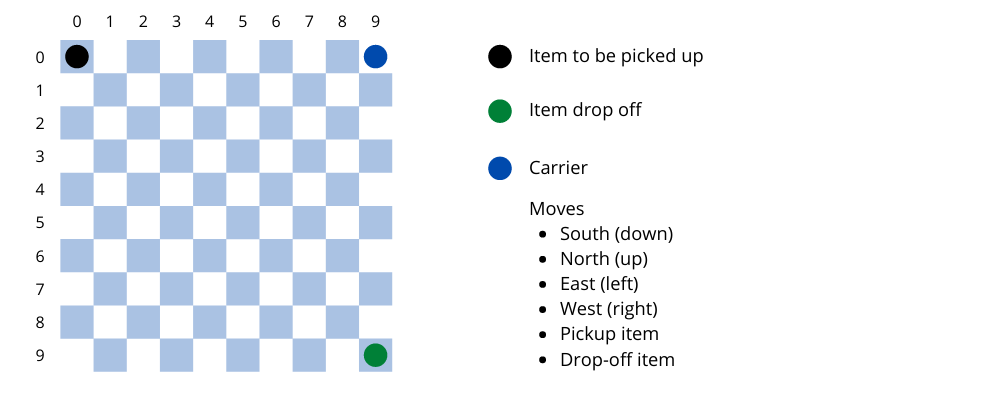

# RL

In this one, I try to make custom environments for a rl algo to learn in.

## 1 . PDE
> PDE is a simple environment, represented using a matrix, where the agent's job is to pickup and deliver a package from a certain point in the matrix to another point specified earlier in the least number of steps possible

[CODE](https://github.com/ShimronAlakkal/ql-env-and-agent/blob/main/QL.ipynb)
  
